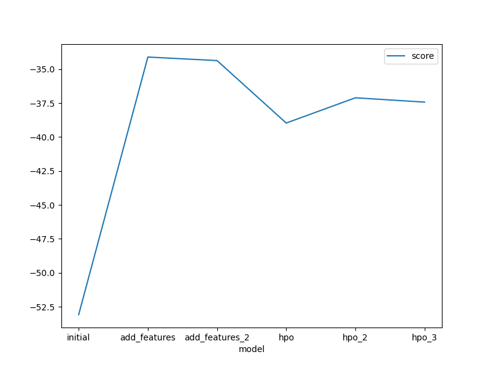
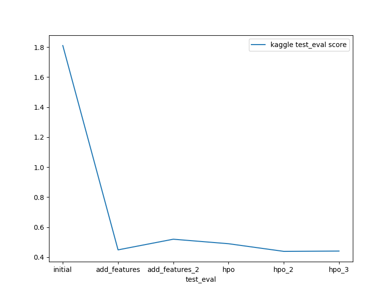

# Report: Predict Bike Sharing Demand with AutoGluon Solution
#### Quoc Viet Vo

## Initial Training
### What did you realize when you tried to submit your predictions? What changes were needed to the output of the predictor to submit your results?
- I uploaded the kaggle.json but did not key in user name and key. When I tried to submit, I got nothing. Then I fixed that and it worked well.
- Secondly, if the prediction gets negative values, submision will get error. Therefore, I need a step to change all negative value to 0. However, I did not frequently get negative values when doing initial training. 

### What was the top ranked model that performed?
- Based on Kaggle score, the top ranked model is "WeightedEnsemble_L3" which obtained a score of 0.439 when I added additional features of "years, months, days of week and hours, peak_hour" and finetuned with "GBM,XT,XGB,NN".
- Based on leader board, the top ranked model is "WeightedEnsemble_L3" which achieved a score of -34.112574 when I added additional features of "years, months, days of week and hours" without any finetune.
- In general, the top ranked model trained with additional features performs better because the dataset has more underlying features that provide more useful information to the prediction of models.

## Exploratory data analysis and feature creation
### What did the exploratory analysis find and how did you add additional features?
- The exploratory analysis shows that "count" has a higher number at some specific "hours" and "months". It indicates that these two features should provide more information for prediction. 
- I splitted these new features together with "year" or "week of days" and added to the train set by creating new columns.
- I created another feature called "peak_hours" based on specific times such as 7-9am or 17-18pm.

### How much better did your model preform after adding additional features and why do you think that is?
- Additional features help improve the performance in general. For example,  "year, month, day, hour" helps improve the kaggle score from 1.8 to 0.449. It is because the "count" may have stronger relationship with the "hour" or "days of week" or "month" rather than as a whole datatime. 
- However, adding more features (i.e. peak_hour) does not help improve. It could be this feature does not bring more useful information that may be already included in "year, month, day, hour".

## Hyper parameter tuning
### How much better did your model preform after trying different hyper parameters?
- In general, my model preforms better after trying different hyper parameters for "GBM,XT,XGB,NN". However, if I just finetune "GBM,NN" or more "GBM,KNN,XT,XGB,RF,NN", it does not really help improve the performance.

### If you were given more time with this dataset, where do you think you would spend more time?
- I would investigate additional hyperparameters and other settings as well as times/number of trials. If AutoGluon has addtional time/number of trials with a high quality preset, the hyperparameter tuning can be enhanced.

### Create a table with the models you ran, the hyperparameters modified, and the kaggle score.

|model|problem_type|eval_metric|time_limit|presets|num_trials|scheduler|search_strategy|hp-method|score
|--|--|--|--|--|--|--|--|--|--|
|initial|regression|root_mean_squared_error|600|best_quality|None|None|None|default|1.810
|add_features|regression|root_mean_squared_error|600|best_quality|None|None|None|default|0.449
|add_features_2|regression|root_mean_squared_error|600|best_quality|None|None|None|default|0.520
|hpo|regression|root_mean_squared_error|600|best_quality|10|local|auto|GBM,NN|0.490
|hpo_2|regression|root_mean_squared_error|600|best_quality|20|local|auto|GBM,XT,XGB,NN|0.439
|hpo_3|regression|root_mean_squared_error|600|best_quality|30|local|auto|GBM,KNN,XT,XGB,RF,NN|0.441

### Create a line plot showing the top model score for the three (or more) training runs during the project.

### Create a line plot showing the top kaggle score for the three (or more) prediction submissions during the project.

## Summary

This section discusses the impact of adding additional features and changing hyperparameters on the outcomes of the Kaggle score.

1. Adding additional features:
  - Additional features help improve the performance in general. For example,  "year, month, day, hour" helps improve the kaggle score from 1.8 to 0.449. 
  - However, beside new features about time, adding new features of "peak_hour" does not help improve. It could be this feature does not bring more useful information that may be already included in "year, month, day, hour".

2. Changing hyperparameters (auto finetuning):
  - In general, changing hyperparameters for specific models such as "GBM,XT,XGB,NN" help improve the kaggle score if comapred with tuning only two "GBM,NN". For instance, the kaggle score is improved from 0.49 to 0. 439. 
  - Nonetheless, changing hyperparameters for more models such as "GBM,KNN,XT,XGB,RF,NN" does not improve the kaggle score if compared with only four models "GBM,XT,XGB,NN". It could be due to the fact that, "KNN, RF" do not have high performance in this problem and changing them does not benefit at all.
